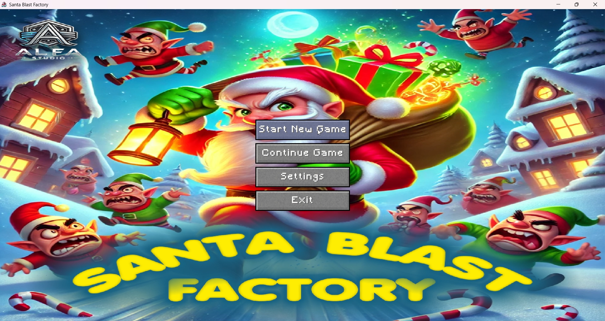
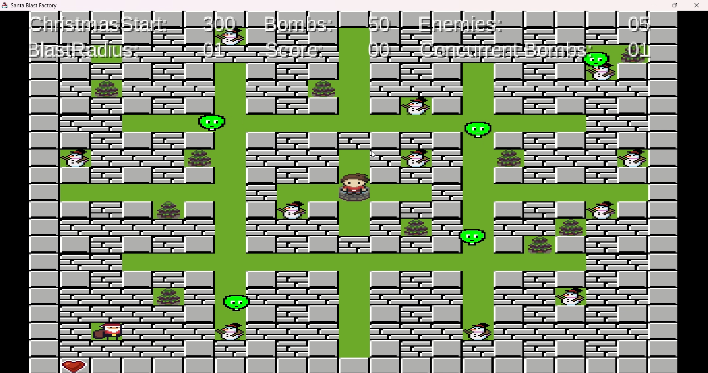
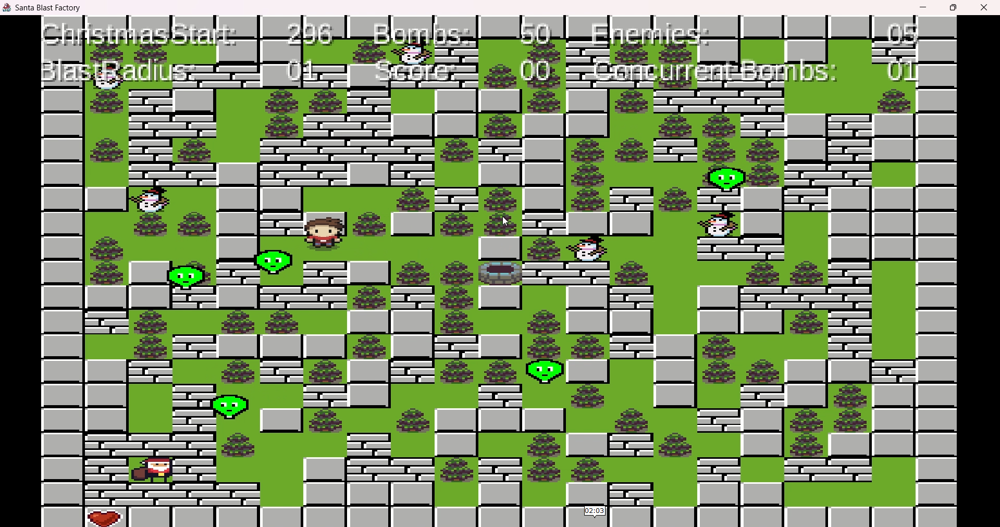
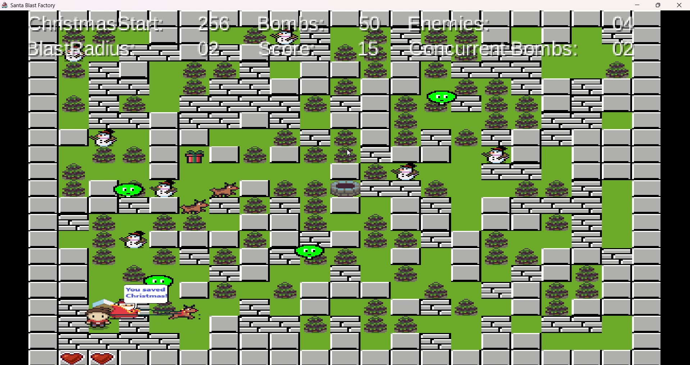

# 🎅 Santa Blast Factory

**Santa Blast Factory** is a 2D action/puzzle maze game where you play as a hero on a mission to save Santa Claus before Christmas! Navigate through the maze, defeat enemies using bombs, uncover hidden power-ups, and rescue Santa to win the game.

---

## 🕹️ Features
- Place bombs to destroy enemies and obstacles (bombs explode after **3 seconds**).
- Hidden **power-ups** in destructible tiles boost your abilities.
- **Powerdowns** reduce your abilities or spawn extra enemies.
- Save Santa to **gain extra time**.
- Unlock the exit after defeating all enemies and saving Santa.
- HUD tracks: **score, bombs, blast radius, enemies left, time remaining, and lives**.
- Pause/resume game and mute/unmute sounds.

---

## ⚡ Power-ups
| Power-up | Effect |
|----------|--------|
| Extra lives | Up to 2 extra lives (tracked with heart counter) |
| Extra bombs | Up to 5 additional bombs |
| Speed boost | Double movement speed |
| Blast radius | Increase up to 8 tiles |
| Concurrent bombs | Place up to 8 bombs simultaneously |

---

## 💀 Powerdowns
| Powerdown | Effect |
|-----------|--------|
| Lose bombs | Lose 5 bombs |
| Spawn enemies | 3 extra enemies appear |

*Powerdowns are collected automatically when revealed and only once.*

---

## 🎮 How to Play
1. Move through the maze using arrow keys or WASD.
2. Place bombs to defeat enemies.
3. Collect power-ups to boost your abilities.
4. Free Santa by destroying the tiles around him.
5. Defeat all Grinch enemies to unlock the exit.
6. Escape before time runs out!

> **Tip:** Saving Santa gives extra time—plan your moves carefully!

---

## 🛠️ Technical Details
- **Engine:** LibGDX
- **Language:** Java
- **Game Type:** 2D tile-based
- **Team:** 2 developers (pair project)
- **Map size:** 21x21 tiles
- **Resolution:** 1920×1080 virtual, scaled by 4
- **Enemy behavior:** Scripted movement (no AI)
- **Bomb mechanics:** Timed explosions affecting tiles and enemies

---

## 📸 Screenshots

---
## 📄 License
This project is for educational purposes. Please credit the original developers:  
**Madushan & Nadia**